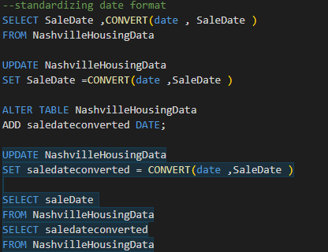
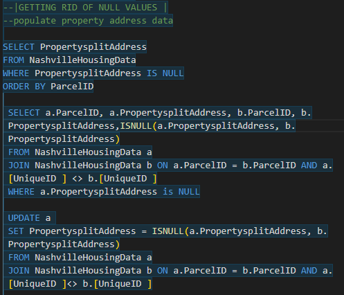
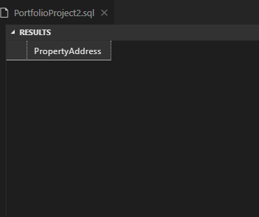
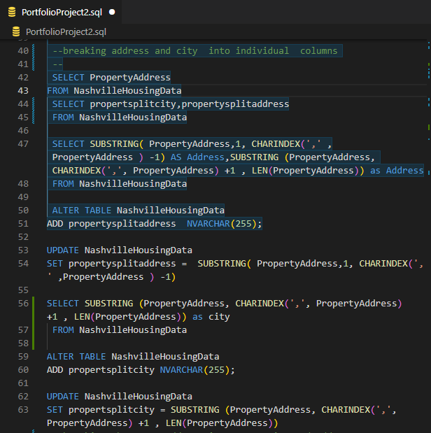
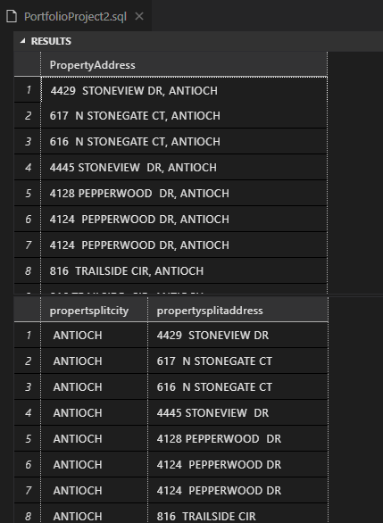
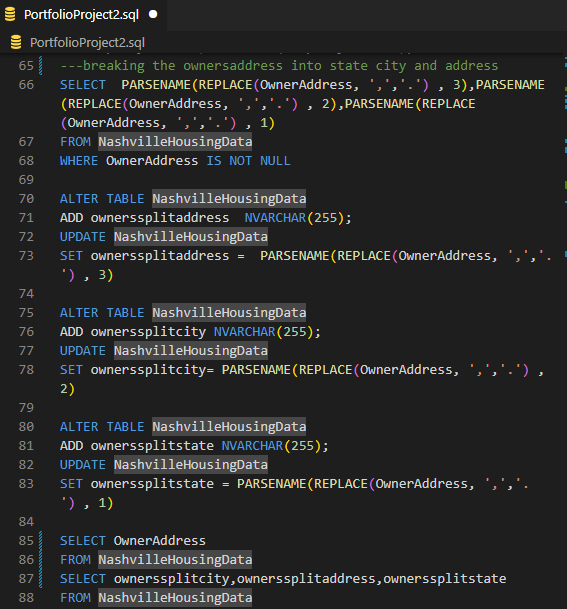
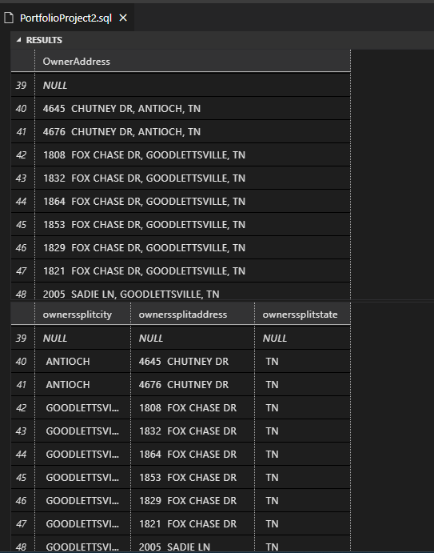

 # Nashville Housing Data 
 
 ---
 # Nashville Housing Data Cleaning
 

 ## Introduction
This is an SQL Data cleaning project on **Nashville Housing Dataset** inspired by Alex Analyst. The project entails  several Data cleaning techniques that  are achieved by the use of SQL Server. The Dataset is later analysed and visualized by Tableau and Power BI. This is the second project on Data Analyst Bootcamp by Alex The analyst. 
**_Disclaimer_**:_The Dataset does not represent any country or institution and it's a dummy dataset to demonstrate data cleaning techniques using SQL server_

## Problem Statement
The Nashville Housing Dataset contain a lot of duplicates and null values. The date format in the SalesDate column was in the wrong format. Some columns are not required for data analysis and visualisation hence need to be dropped.

## Skills/Concepts demonstrated
The following SQL Server Data cleaning Techniques were incorporated:
- Use of UPDATE & ALTER functions 
- use of CONVERT functions 
- Converting Date/Time format
- Use of SELF-JOINS to populate a null column 
- Use of SUBSTRING and CHARINDEX functions 
- Use of REPLACE and PARSENAME functions 
- Use of CASE statements 
- Use of CTEs and PARTITION BY to check Duplicates 
- DROP & DELETE functions 

## Data Sourcing 
The Dataset is called Nashville Housing Data and it contains 21 columns with 56580 rows. It describes the information of Nashville property owners and the Home value Market in the Nashville area.The Dataset was downloaded from [Kaggle](https://www.kaggle.com/datasets/tmthyjames/nashville-housing-data) and you can preview it  [Here](Nashville%20Housing%20Data%20for%20Data%20Cleaning.xlsx)

## Data Cleaning
1.<u>Changing Date/time format to YYYY-MM-DD:</U>
I used the CONVERT function and created a new table called Saledateconverted which I will be using for analysis and visualization. Another function you can use is COALESCE or ISNULL  which works faster and has an easier syntax 

 |  Saledatecode             |           Saladate      |
 :-------------------------: |:--------------------------:
    |        

2.<u>Getting rid of Null values by Populating Address Data:</u>The Propertaddress had numerous null, values so I used SELF-JOIN to populate data from the parcel ID 

|Null Property Code  | Null Property address |  
|-----------| ------- |  
|   |  |  

3.<u>Breaking Address and City into Individual Columns:</u>The PropertyAdress column has both city and address separated by a comma hence we will use SUBSTRING and CHARINDEX functions to separate the city and address and create new columns. The new columns will  be propertysplitaddress and propertysplitcity 

| Property split Code  | Property split |  
|-----------| ------- |  
|   |  |  

as you can see from the picture above we have created two extra columns 

4.<u>Breaking OwnersAdress into state, city and Address:</u>The OwnersAdress column contains state, city and address separated by commas. Here I decided to use a different set of functions. I used the REPLACE function together with the PARSENAME functions 

| Owner split Code  | Owner split |  
|-----------| ------- |  
|   |  |  

5.<u>Replacing Y & N with Yes & No:</u>The SoldAsVacant column has Y as Yes and N as No so I used a CASE statement to replace

6.<u>Removing duplicate Values:</u>There were a total of 104 duplicate values in the dataset. I used CTEs and PARTITION BY to find the number of duplicate rows. I also used the DELETE function to Delete the rows.

| RemoveddupCode  | Removeddup |  
|-----------| ------- |  
|   |  |  

7.<u>*Final Step*:Deleting Unused/Unnecessary Columns:</u>
I dropped unnecessary columns using the DROP COLUMN function 

## Conclusion 
This being my First SQL data cleaning project I would like to give a big thanks to [AlexTheAnalyst](https://www.youtube.com/@AlexTheAnalyst) for the guidance. I have learned a lot and as always the journey continues.The rest of the code is found [Here](PortfolioProject2.sql)

Feel Free  to follow me on [Twitter](https://twitter.com/DEVSINMOR) for more SQL content

